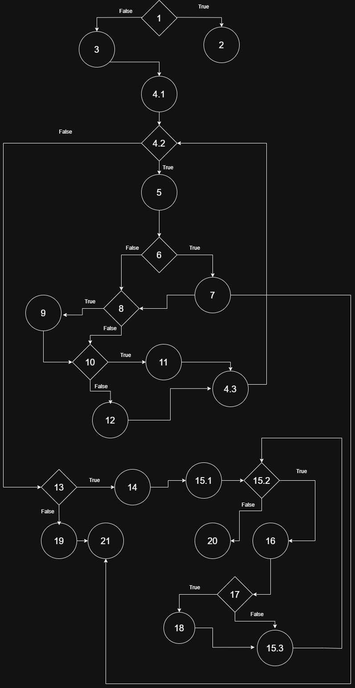
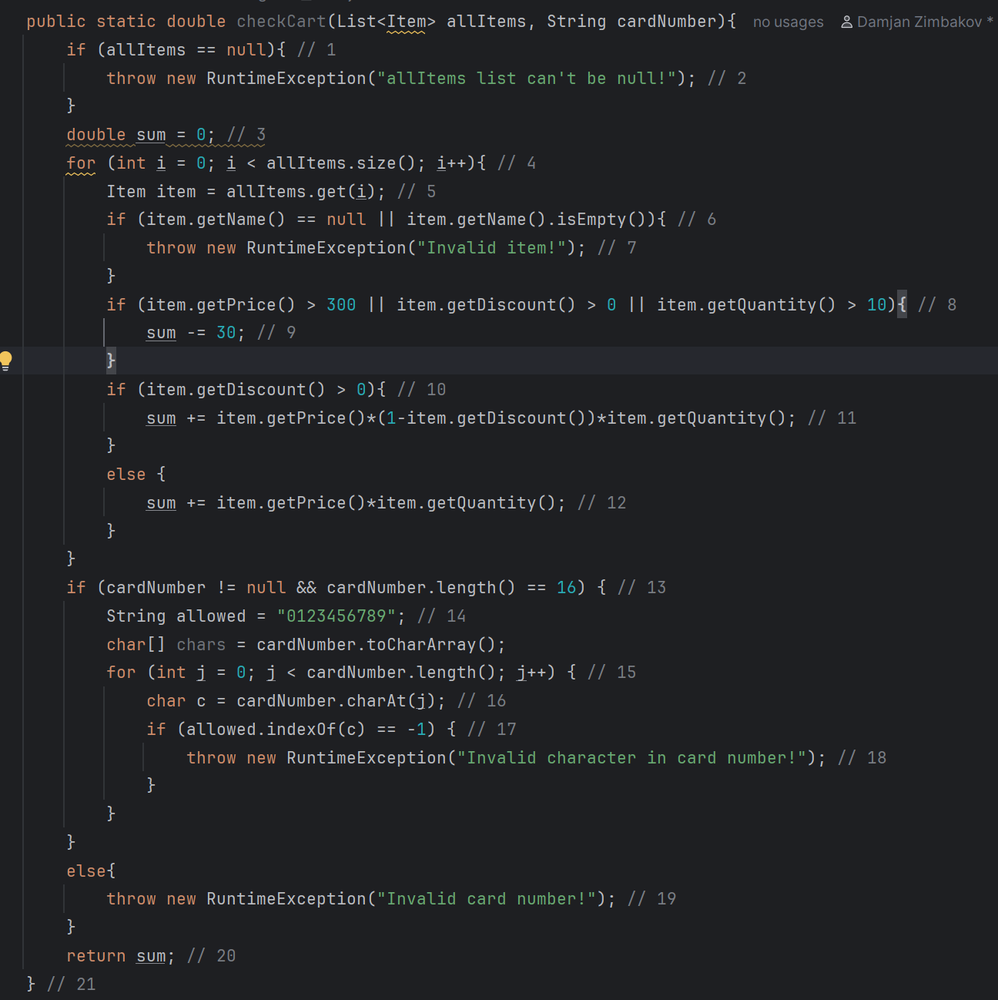

# SI_2025_lab2_236093

## Дамјан Зимбаков 236093

## Control Flow Graph

## Цикломатска комплексност
Цикломатската комплексност на овој код е 9, комплексноста ја добив преку бројот на региони.

## Unit тестови
Тест 1 - allitems = null, cardNumber = "", RuntimeException("allItems list can't be null!") 

Тест 2 - allitems = [{'Laptop', 1, 1, 0}], cardNumber = "", RuntimeException("Invalid card number!")

Тест 3 - allitems = [{'Laptop', 1, 1, 0}], cardNumber = "123451234512345a", RuntimeException("Invalid character in card number!"")

Тест 4 - allItems = [{null, 0, 0, 0}], cardNumber = "", RuntimeException("Invalid item!") 

Тест 5 - allitems = [{'Laptop', 1, 1, 0}], cardNumber = "1234512345123456", 1

1. allItems = [{'Laptop', 0, 250, 0}] -30
2. allItems = [{'Laptop', 0, 1, 0.1}] -30
3. allItems = [{'Laptop', 2, 3, 0}] 6
4. allItems = [{'Laptop', 15, 10, 0}.1] 105
